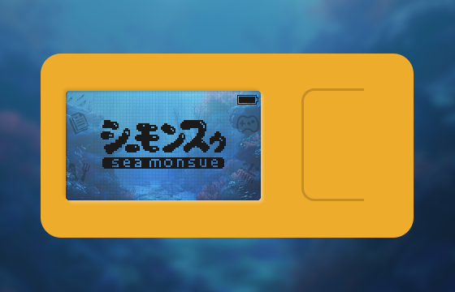

# Digital Pet "Seamonsue"

## Overview
A game about raising strange arthropods that runs on the M5StickC Plus2.
Players raise their pets through three actions: eating, playing games and cleaning.
Depending on the frequency of these actions, Seamonsoo grows to have different characteristics.

## Operating Environment
M5StickC Plus2

## Installation Method
1. Install the Arduino IDE.
2. Download [arduino_seamonsue.zip](https://github.com/hsbsbz/M5StickCPlus2-Seamonsue/raw/master/arduino_seamonsue.zip).
3. Unzip the downloaded [arduino_seamonsue.zip](https://github.com/hsbsbz/M5StickCPlus2-Seamonsue/raw/master/arduino_seamonsue.zip) and open `seamonsue.ino` with Arduino IDE.
4. Select the M5StickCPlus2 board.
5. Build the project and upload it to the device. (This may take some time)

## How to Operate

### Common to All Screens
- Long press the C button to sleep
If no operation is performed for a certain period of time, it will automatically go to sleep.

### Home Screen
- Press the A button to confirm the menu
- Press the B button to switch the menu
- Long press the B button to go to the reset screen
- Press the C button to cancel the menu selection

### Parameter Screen
- Press the A button to switch the page
- Press the B button to switch the page
- Long press the B button to go to the reset screen
- Press the C button to cancel the menu selection

### Game Screen
Avoid the fish and get the hearts.
- Tilt the device to move Seamonsue
- Press the C button to interrupt the game and return to the home screen

## Screenshot

